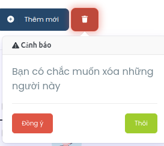

# button-confirm-tk

## Description
The ButtonConfirm component is a React component designed to provide a customizable confirmation popover for user interactions. It offers a convenient way to prompt users for confirmation before executing a critical action, such as deleting an item or submitting a form.

## Key Features:
1. Customizable Content: Users can define the body text, header text, and button labels to tailor the confirmation popover to their specific use case.
2. Flexible Trigger Button: The component accepts any JSX element as the trigger button, allowing developers to integrate the confirmation functionality seamlessly into their application's UI.
3. Event Handling: Developers can specify callback functions to be executed upon confirmation or cancellation, enabling them to perform appropriate actions based on user input.
4. Z-index Control: The component provides control over the z-index of the popover, ensuring proper layering with other UI elements.

## Installation

You can install ButtonConfirm via npm:

```bash
npm install button-confirm-tk
```

or

```bash
yarn add button-confirm-tk
```



## Usage

```javascript
import React from 'react';
import ButtonConfirm from 'button-confirm-tk';

const MyComponent = () => {
  return (
    <div>
      <ButtonConfirm
        onConfirm={() => {
          // handle confirmation
        }}
        onClose={() => {
          // handle close
        }}
        body="Are you sure you want to proceed?"
        btnContent={<button>Open Confirmation</button>}
        btnClass="my-button-class"
        header="Confirmation"
        zIndex={1000}
        okeTxt="OK"
        closeTxt="Cancel"
      />
    </div>
  );
};

export default MyComponent;
```
## Props

| Name        | Type               | Description                                           |
|-------------|--------------------|-------------------------------------------------------|
| onConfirm   | Function           | Function to execute when the confirm button is clicked. |
| onClose     | Function           | Function to execute when the close button is clicked. |
| body        | string             | Body text of the confirmation popover.                |
| btnContent  | JSX.Element        | JSX element for the button that triggers the confirmation popover. |
| btnClass    | string             | CSS class for the trigger button.                     |
| header      | string             | Header text of the confirmation popover.              |
| zIndex      | number             | Z-index of the popover.                               |
| okeTxt      | string             | Text for the confirm button.                          |
| closeTxt    | string             | Text for the close button.                            |


## Version
1.0.0

## Author
tk0038

## License
ISC